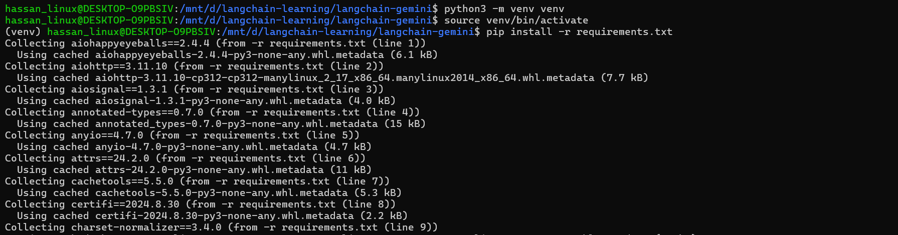
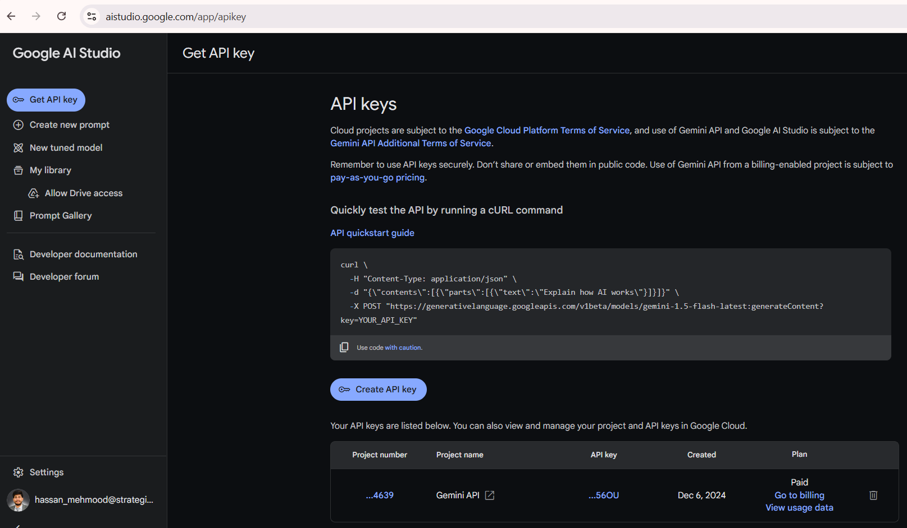
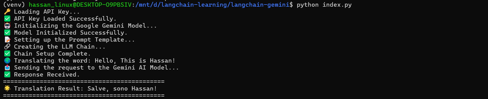

# LangChain + Google Gemini AI Model Integration Example

This repository demonstrates how to integrate [LangChain](https://github.com/hwchase17/langchain) with [Google Gemini](https://ai.google/) to build AI-powered applications using multimodal capabilities. It's designed as a starting point for developers looking to explore and experiment with LangChain and Google Gemini AI.

## 🚀 Features
- **Seamless integration**: Connect LangChain with Google Gemini for text and multimodal tasks.
- **Beginner-friendly**: Simple setup to get started quickly.
- **Extensible**: Encourage contributions and customizations for advanced use cases.

---

## 🛠️ Setup Instructions

Follow these steps to set up and run the project on your local machine:

### 1. Clone the Repository
```bash
git clone https://github.com/hmshb/langchain-google-gemini-integration.git
cd langchain-google-gemini-integration
```

### 2. Create a Virtual Environment
```bash
python -m venv venv
source venv/bin/activate  # For Linux/Mac

.\venv\Scripts\activate # For Windows
```

### 3. Install Dependencies
```bash
pip install -r requirements.txt
```



### 4. Generate a Google API Key
1. Visit Google AI Studio.
2. Create an API key for accessing Google Gemini.
3. Copy the generated API key.



### 5. Update ```.env``` File
 - Add the following line to the .env file, replacing your_google_api_key with your actual API key:
    ```
    GEMINI_API_KEY=your_google_api_key
    ```
   
### 6. Run the project
```bash
python index.py
```



---

## 📂 Project Structure
```
langchain-google-gemini-integration/
├── .env                 # API key configuration file
├── index.py             # Main script to demonstrate LangChain + Gemini integration
├── requirements.txt     # Optional: Use for dependencies
├── README.md            # Documentation file
├── venv/                # Virtual environment
```

---

## ⭐ Acknowledgments

Special thanks to:

- **[LangChain](https://github.com/hwchase17/langchain)** for providing a robust framework for building LLM applications.
- **[Google Gemini](https://ai.google/)** for their powerful multimodal AI capabilities.

---

## 📜 License

This project is open-source and licensed under the [MIT License](LICENSE).

---

## 📢 Get Involved!

If you find this repository helpful, please consider:

- ⭐ **Starring the Repository** to show your support.
- 📤 **Forking the Repository** to explore further and make your own customizations.
- 💬 **Sharing Your Feedback** by opening issues or discussions.

Let's build amazing AI-powered applications together!